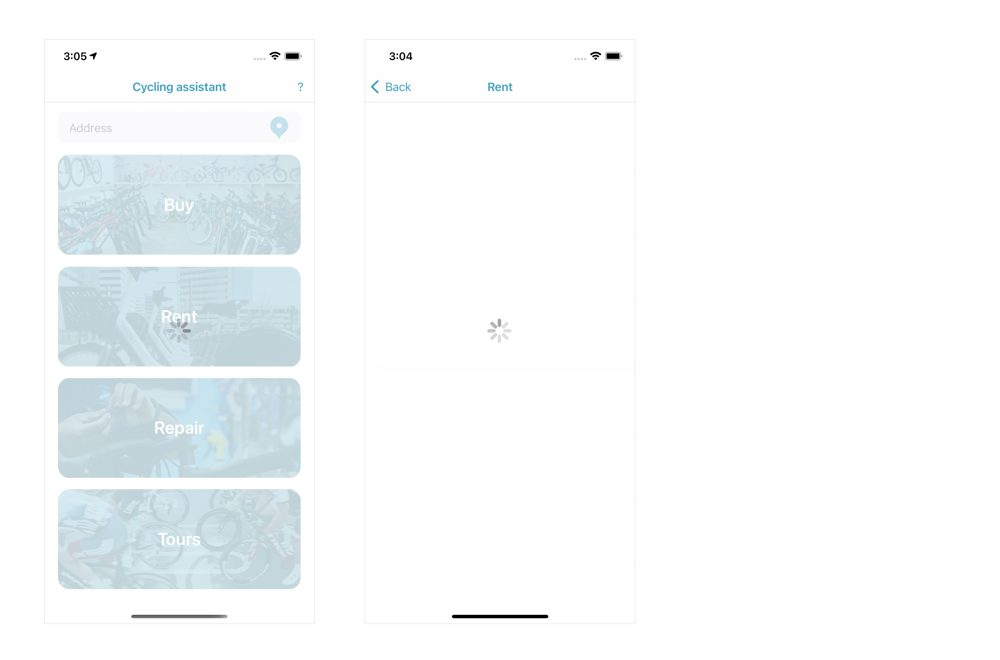

# CyclingAssistant
## Overview

Cycling Assistant is an iOS app developed in Swift 5.
This App was made by me as part of the course on Coursera "App Design and Development for iOS" from the University of Toronto, and was further modified according the improvement of my knowledge.

Cycling Assistant allows you to receive up-to-date information about the best local services related to cycling: where is the nearest store, where you can rent a bike, repair it or find an association organizing bike tours. I use Yelp API from the site www.yelp.com to get all the information.

## Features
* Swift Programming Language
* UIStackView, UITableView, UITableViewCell, Structured files


* UIKit, MapKit, CoreLocation


* Activity Indicator, completionHandler




## How to build
1. Clone the repository
```
$ git clone https://github.com/EllaGlv/cycling-assistant-ios-app.git
```
2. Open the project in Xcode
```
$ open "CyclingAssistant.xcodeproj"
```
3. Sign up on [https://www.yelp.com/login](https://www.yelp.com/login) to get an API ID. 
In file “DataManager.swift” (line 20) please replace  “MyYelpApiKey” on your API ID

4. Compile and run the app in your simulator or on the device.
5. If you don't see any data in simulator, please check "Simulator" -> "Debug" -> "Location" to change the location.

## Requirements

- Xcode
- iOS 13+
- Swift 5
